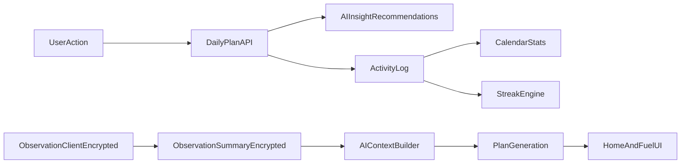

# FitNexus

**FitNexus** is the wellness application in the **numbers-don’t-lie** repository. It turns your profile, habits, and daily signals into a structured health plan—movement, nutrition, and mindfulness—so recommendations stay grounded in what you actually do. The stack is **Next.js 16**, **React 19**, **PostgreSQL**, **Prisma**, and the **OpenRouter API**.

---

## Table of contents

1. [Capabilities](#capabilities)
2. [Tech stack](#tech-stack)
3. [Prerequisites](#prerequisites)
4. [Getting started](#getting-started)
5. [Railway deployment](#railway-deployment)
6. [Environment variables](#environment-variables)
7. [Database reset and clean installs](#database-reset-and-clean-installs)
8. [Security](#security)
9. [Using the application](#using-the-application)
10. [AI, observations, and fallbacks](#ai-observations-and-fallbacks)
11. [Data flow](#data-flow)
12. [Architecture notes](#architecture-notes)
13. [Repository layout](#repository-layout)
14. [Troubleshooting](#troubleshooting)

---

## Capabilities

| Area | Description |
|------|-------------|
| **Multi-goal onboarding** | Select **1–3** wellness goals during onboarding; strategy adapts (focused vs. balanced) based on how many you choose. |
| **Daily Top 3 plan** | AI-generated movement, nutrition, and mindfulness actions with **persistent completion** and **idempotent** updates (no duplicate or inflated counts). |
| **Activity and calendar** | Completing Top 3 actions is reflected in **activity logs** and the **activity calendar** so streaks and day stats stay consistent. |
| **Nutrition and recipes** | Meal-of-the-day style guidance, **allergy- and restriction-aware** recipe filtering, and an expanded catalog (including vegan and plant-forward options). |
| **Inspire Me** | Curated **mindfulness, breathing, sleep, and meditation** guidance under Fuel; content can **rotate** with a **bundled offline fallback** when the network or upstream source is unavailable. |
| **Observation layer (hybrid)** | Check-ins and daily aggregates (food/water, sleep/stress, activity) support **encrypted local cache** and **server-side encrypted summaries** for cross-device planning—AI uses **aggregates**, not raw sensitive events, where applicable. |
| **Wellness score and trends** | Composite **0–100** score, weight trends, habit streaks, and weekly AI summaries. |
| **Preserve mode** | When you indicate burnout, plans shift toward recovery-oriented actions. |
| **Authentication and data** | Email/password, optional GitHub/Google OAuth, **TOTP 2FA**, and **JSON data export**. |

---

## Tech stack

| Layer | Technologies |
|-------|----------------|
| Framework | Next.js 16, React 19, TypeScript 5 |
| Styling & motion | Tailwind CSS 4, Framer Motion |
| 3D | Three.js, React Three Fiber, Drei |
| UI | Radix UI, Lucide, Recharts |
| Data | PostgreSQL 16 (Docker), Prisma 7 |
| Auth | Auth.js / NextAuth 5 (beta)—credentials, OAuth, 2FA |
| AI | OpenRouter API (OpenAI-compatible) |
| Email | Gmail SMTP (primary) + Resend fallback |
| Forms | React Hook Form, Zod 4 |

---

## Prerequisites

- **Node.js 22+**
- **Docker** and Docker Compose (for PostgreSQL and optional full-stack run)

---

## Getting started

### Local development

```bash
npm install
cp .env.example .env
docker compose up -d db
npx prisma migrate deploy
npx prisma generate
npm run dev
```

Open **http://localhost:3000**. You should see the landing page with the 3D wellness orb.

### Docker development mode (hot reload)

Runs **Postgres** and the **Next.js dev server** in containers with a clear **banner in the terminal** (URLs, ports, tips). Source is bind-mounted; `node_modules` and `.next` use named volumes so the host does not need a local `npm install` for the container to run.

```bash
cp .env.example .env
# NEXTAUTH_SECRET and DATABASE_URL for build args (see below)
npm run docker:dev
```

Or explicitly:

```bash
docker compose -f docker-compose.yml -f docker-compose.dev.yml up --build
```

- **App:** http://localhost:3000  
- **Postgres:** `localhost:5433` (same as the production-style Compose stack)  
- Stop: `npm run docker:dev:down` or `docker compose -f docker-compose.yml -f docker-compose.dev.yml down`  
- After changing **dependencies**, rebuild: `npm run docker:dev` with `--build`, or run `npm ci` inside the app container.

File watching uses **polling** (`WATCHPACK_POLLING` / `CHOKIDAR_USEPOLLING`) so edits on macOS/Windows Docker Desktop reliably trigger reloads.

### Full stack with Docker (production-style image)

Runs the application and database in containers (no local Node required for runtime).

```bash
cp .env.example .env
# Optional: free ports if something is already bound
kill -9 $(lsof -t -i:3000) $(lsof -t -i:5433) 2>/dev/null || true
docker compose up -d --build
```

Set **`DATABASE_URL`** in `.env` (or export it in the shell) before `docker compose build` or `docker compose up --build`. The image build runs `prisma generate` and `next build`, which read that variable; use the same connection string style as local development (often `...@localhost:5433/...` when Postgres is exposed on the host port from Compose).

Open **http://localhost:3000**. Compose brings up the database, applies migrations via the app entrypoint, and starts the server. After code changes, rebuild with:

```bash
docker compose up -d --build
```

## Railway deployment

The repo includes [`railway.toml`](railway.toml) (Dockerfile builder, `/api/health` healthcheck). Deploy the **web service** from this repository and add a **PostgreSQL** plugin (or external Postgres). Railway injects `PORT` and `DATABASE_URL` automatically.

**Build-time**

- **`DATABASE_URL`** — Required for `prisma generate` and `next build` inside the image. Use the same variable Railway provides for Postgres (Railway passes service variables into Docker builds when names match your `ARG`s).
- **`NEXT_PUBLIC_APP_URL`** — Set to your public app URL (for example `https://<service>.up.railway.app` or your custom domain). This is baked into the client bundle and used for Server Actions allowed origins. After you add a generated domain or custom hostname, set this and redeploy.

**Runtime** (service variables)

- Copy values from [Environment variables](#environment-variables): `NEXTAUTH_SECRET`, `AUTH_SECRET` (same as NextAuth secret), `NEXTAUTH_URL` and `AUTH_URL` (use your **https** public origin, not localhost), `AUTH_TRUST_HOST=true`, `NEXT_PUBLIC_APP_URL` and `NEXT_PUBLIC_APP_NAME`, email and AI keys as needed.
- OAuth redirect URIs must use your production origin, for example `https://<your-host>/api/auth/callback/google`.

On each deploy, [`start.sh`](start.sh) runs `prisma migrate deploy` before `node server.js`, so migrations apply automatically.

---

## Environment variables

Create `.env` from `.env.example`. **Do not commit secrets.**

### Required

| Variable | Purpose |
|----------|---------|
| `DATABASE_URL` | PostgreSQL connection string. With default Docker Compose, typically `...@localhost:5433/fitnexus_db` (see `docker-compose.yml`). |
| `NEXTAUTH_SECRET` | Random secret; e.g. `openssl rand -base64 32`. |
| `NEXTAUTH_URL` | App origin, e.g. `http://localhost:3000`. |
| `AUTH_SECRET` | Same value as `NEXTAUTH_SECRET` (used in Docker-oriented Auth.js setup). |
| `AUTH_URL` | Auth base URL, e.g. `http://localhost:3000/api/auth`. |
| `AUTH_TRUST_HOST` | Set to `true` when running behind Docker or a reverse proxy. |
| `OPENROUTER_API_KEY` | From [OpenRouter keys](https://openrouter.ai/keys). |

### Optional

| Variable | Purpose |
|----------|---------|
| `GITHUB_CLIENT_ID` / `GITHUB_CLIENT_SECRET` | GitHub OAuth—[GitHub Developer Settings](https://github.com/settings/developers). |
| `GOOGLE_CLIENT_ID` / `GOOGLE_CLIENT_SECRET` | Google OAuth—[Google Cloud Console](https://console.cloud.google.com/). |
| `SMTP_HOST`, `SMTP_PORT`, `SMTP_USER`, `SMTP_PASS` | Outbound email (primary path). Gmail often uses an [App Password](https://myaccount.google.com/apppasswords). |
| `RESEND_API_KEY` | Optional fallback email provider via [Resend](https://resend.com/api-keys). |
| `EMAIL_FROM` | From address, e.g. `FitNexus <you@gmail.com>`. |
| `OPENROUTER_MODEL` | Overrides the OpenRouter model (e.g. `google/gemma-2-9b-it:free`). |
| `OPENAI_EMBEDDING_MODEL` | Optional. Embedding model id for recipe RAG (defaults to `text-embedding-3-small` when using the OpenAI-compatible embeddings endpoint). |

OAuth and outbound email are optional: without them, social login and automated email flows are limited or unavailable. If `OPENROUTER_API_KEY` is missing, the app uses **fallback plans** instead of failing at runtime.

---

## Phase 2: nutrition catalog, meal plans, and RAG

The app includes a **nutrition catalog** (`Ingredient`, `Recipe`, `NutritionFacts`, `MealPlan`) and a **3-step meal-plan pipeline** (strategy → schedule → recipe generation with the `calculate_nutrition` tool). Macro targets use **Mifflin–St Jeor + activity factor** (`src/lib/nutrition/tdee.ts`). Recipe similarity uses **JSON-stored embedding vectors** and cosine similarity in the app (`src/lib/nutrition/rag.ts`); you can later move to **pgvector** in Postgres for large catalogs without changing the UI flow.

**Seed the catalog (500+ ingredients and 500+ recipes)** after migrations:

```bash
npx prisma db seed
```

(Configure `DATABASE_URL`; seed is defined in `prisma.config.ts`.)

**APIs**

| Endpoint | Purpose |
|----------|---------|
| `GET /api/nutrition/targets` | TDEE and macro targets from the health profile |
| `GET /api/meal-plans` | Latest saved meal plan |
| `POST /api/meal-plans/generate` | Run the pipeline (rate-limited) |

The **Intake** (`/fuel`) page shows macro pie and calorie balance charts plus the meal plan panel. Weekly AI summaries (`POST /api/insights/weekly`) include a short **nutrition hint** from the latest meal plan when available.

**Docker:** the default Compose file uses the standard Postgres image; embeddings are stored as JSON arrays, so no `pgvector` extension is required. For very large vector indexes, switch to a `pgvector`-enabled image and migrate the `Recipe.embedding` column to `vector(1536)` in a follow-up migration.

---

## Database reset and clean installs

Emails are unique in Postgres. To **register again with the same address** during testing, reset the database or delete the user row.

**Important:** Run Compose commands from the **repository root** (where `docker-compose.yml` lives). The `DATABASE_URL` in `.env` must point at **that** Postgres instance (often `localhost:5433` when the DB container maps that port). Pointing at another instance (e.g. local Postgres on `5432`) means `docker compose down -v` will **not** wipe the data your app uses.

### Reset with Docker volume removal (typical local dev: app via `npm run dev`, DB in Docker)

```bash
cd /path/to/numbers-dont-lie

docker compose down -v
docker compose up -d db
# Wait ~5s for Postgres to accept connections
npx prisma migrate deploy
npx prisma generate
```

### Optional: confirm the volume is gone and user count is zero

```bash
docker volume ls | grep postgres

docker exec -it fitnexus_db psql -U fitnexus_user -d fitnexus_db -c 'SELECT COUNT(*) AS users FROM "User";'
```

Adjust the container name if yours differs (`docker ps`).

### Reset schema only (same `DATABASE_URL`, keeps volume)

```bash
npx prisma migrate reset
```

Confirm with `y`. This drops data and reapplies migrations.

### Full stack (app + DB in Docker)

```bash
docker compose down -v
docker compose up -d --build
```

The **`-v`** flag removes the named Postgres volume for **this** Compose project. Without **`-v`**, existing users remain and duplicate sign-up emails will be rejected.

### If reset still looks wrong

1. Confirm **`docker compose down -v`** was used (without **`-v`**, the volume persists).
2. Confirm **`DATABASE_URL`** matches host, port, and database name for the instance you reset.
3. Run Compose from the directory that contains **`docker-compose.yml`**.
4. Restart **`npm run dev`** after changing **`.env`** so the app reconnects.

---

## Security

For encryption at rest and in transit, secret handling, and related practices, see **`SECURITY.md`**. Never commit real `.env` files or keys.

---

## Using the application

| Route | Description |
|-------|-------------|
| **`/`** | Landing page: 3D wellness orb, feature overview, how it works. |
| **`/signup`** | Registration—email/password or OAuth. Email flow supports Resend API or Gmail SMTP for verification. |
| **`/onboarding`** | Six-step profile: **basics**, **goals (1–3)**, **diet** (preferences and restrictions), **fitness**, **lifestyle**, **baseline** (stress, AI consent). |
| **`/home`** | Command Center: daily AI plan (Top 3), orb, stress check-in, insights, meal of the day, **Generate AI Plan**. |
| **`/fuel`** | Nutrition: meal guidance, tips, meal log; **`/fuel/recipes`** for allergy-aware browsing and **Inspire Me** content. |
| **`/vitality`** | Check-ins, streaks, clickable **activity calendar**, manual activity logging. |
| **`/blueprint`** | Wellness score detail, weight trend, profile, security (password, 2FA), privacy, export. |

---

## AI, observations, and fallbacks

**Daily plans** use your health profile, recent habits (e.g. sleep, stress, hydration), activities, meals, wellness score, Preserve mode, and—where enabled—**aggregated observation signals** so suggestions stay relevant without exposing unnecessary raw detail.

**Weekly summaries** review completion, averages, and trends, then surface wins and focus areas.

If the OpenRouter key is absent or the API errors, the app uses **defaults** and may set a **`fallbackUsed`** (or equivalent) flag so the UI can distinguish AI output from fallback content.

---

## Data flow

High-level path from user actions and observations through APIs and storage to AI planning and the Home/Fuel UI. Arrows show the main data direction, not every internal call.



---

## Architecture notes

- **Prisma 7** uses **`prisma.config.ts`** for the datasource URL and migrations path; the client is constructed with a **PostgreSQL adapter** (`PrismaPg`) as required for this setup.
- **Auth.js** is split: an **edge-safe** config for middleware and a **full** server config with Prisma and password hashing—middleware cannot import Node-only modules.
- **OpenRouter/OpenAI client** is initialized **lazily** on first use so builds succeed without a key.
- **Docker** uses a **multi-stage** image; the production container runs **Next.js standalone** output and can run **`prisma migrate deploy`** at startup (see `start.sh`).
- **Environment encryption**: optional **`scripts/env-crypto.mjs`** (AES-256-GCM)—`npm run env.encrypt` / `npm run env.decrypt`.

---

## Repository layout

```
src/
  app/
    (app)/              # Authenticated app (sidebar layout): home, fuel, vitality, blueprint
    (auth)/             # Login, signup, verification, password reset
    api/                # REST-style route handlers (auth, daily-plan, insights, habits, …)
    onboarding/         # Profile wizard
  components/
    three/              # 3D orb
    home/, fuel/, vitality/, charts/, settings/, logging/, ui/, app/
  lib/
    ai/                 # LLM client, prompts, context builder, insight generator
    …                   # Prisma client, auth, wellness score, etc.
prisma/
  schema.prisma
  migrations/
scripts/
  env-crypto.mjs
```

---

## Troubleshooting

| Symptom | What to try |
|---------|-------------|
| `ECONNREFUSED` (database) | Start Postgres: `docker compose up -d db` |
| `UntrustedHost` in Docker | Set `AUTH_TRUST_HOST=true` in `.env` and align with `docker-compose.yml` |
| Port 3000 in use | Stop the other process or pick another port |
| `npm install` peer conflicts | Use `npm install --legacy-peer-deps` |
| `npm audit` shows Next.js vulnerability | Update Next.js: `npm i next@latest` |
| Generic or empty AI plans | Verify `OPENROUTER_API_KEY` and `OPENROUTER_MODEL` env vars |
| Generic “something went wrong” | Database down or migrations not applied—start DB and run `npx prisma migrate deploy` |
| Slow first Docker build | Normal; later builds use layer cache |
| Cannot log in after sign-up | Configure `RESEND_API_KEY` or SMTP vars for verification, or verify the user record manually in the database |
| Email already registered | See [Database reset and clean installs](#database-reset-and-clean-installs) or remove the user row |
| Google / GitHub buttons missing or “social sign-in not configured” | Set `GOOGLE_CLIENT_ID`, `GOOGLE_CLIENT_SECRET`, `GITHUB_CLIENT_ID`, and `GITHUB_CLIENT_SECRET` in `.env`, then **restart** the server or `docker compose up` so the process picks them up. In [Google Cloud Console](https://console.cloud.google.com/) add authorized redirect URI `http://localhost:3000/api/auth/callback/google` (and production URL when deployed). |
| Console: `Extension manifest must request permission` / `message port closed` / `background.js` | Comes from **browser extensions** (password managers, ad blockers), not FitNexus. Try an **Incognito/Private** window with extensions disabled, or another browser. |

```bash
npm install prisma@latest @prisma/client@latest
```

---

*Repository name: **numbers-don’t-lie**. Product name in copy: **FitNexus**.*
